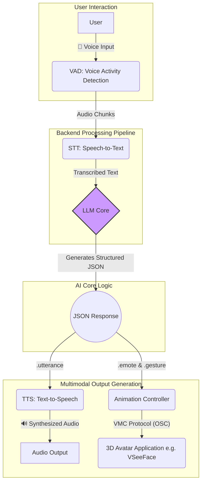

# Ani: A Real-Time, Low-Latency, and Emotionally Expressive AI Companion

<p align="center">
  <strong>A Framework for Building Lifelike, Voice-Driven AI Characters</strong>
  <br>
  <a href="https://github.com/LookJohnny/csci653-as1-anita">Project Repository</a>
</p>

<p align="center">
  <b>Ani</b> is a framework for creating real-time, voice-driven AI companions. It integrates a modular pipeline of state-of-the-art technologies for speech-to-text, large language model (LLM) processing, text-to-speech (TTS), and 3D character animation. Our primary design goal is to achieve sub-400ms backend latency, enabling natural, fluid, and emotionally resonant human-AI interaction.
</p>

---

## Abstract

The pursuit of believable digital agents has been a long-standing goal in artificial intelligence. While large language models (LLMs) have enabled sophisticated conversational abilities, their integration into real-time, interactive characters remains a significant challenge. Key obstacles include high inference latency, the lack of structured emotional and intentional output, and the complexity of orchestrating multiple AI subsystems.

This paper introduces **Ani**, a novel, open-source architecture designed to address these challenges. Ani implements a fully asynchronous pipeline that connects a user's voice to a 3D avatar's response in real-time. The core innovation is a **structured response synthesis** module, where the LLM is constrained to generate a strict JSON schema containing not only the verbal utterance but also corresponding emotional states (`emote`), conversational intents (`intent`), and physical gestures (`gesture`). This structured data directly drives a TTS engine and a VRM avatar via the VMC protocol, resulting in a holistic and expressive character performance.

Our system is backend-agnostic, supporting local, privacy-preserving models via Ollama, as well as powerful cloud APIs from OpenAI and Anthropic. We demonstrate that by optimizing the prompt architecture and leveraging modern async frameworks, we can consistently achieve the target latency, creating a conversational experience that feels immediate and lifelike.

## 1. Introduction

The emergence of powerful LLMs has revolutionized natural language understanding and generation. However, most applications remain text-based, failing to capture the rich, multimodal nature of human communication. An ideal AI companion should not only converse intelligently but also express emotion and intent through tone of voice and body language, reacting to the user with minimal delay.

The Ani project was born from this vision. It serves as both a functional AI companion and a research platform for exploring the following questions:
*   How can we minimize the end-to-end latency from user speech to AI response?
*   How can we compel an LLM to generate structured, multimodal output reliably?
*   What is the most effective way to map abstract emotional data to concrete vocal and physical expression?

Our work presents a practical and extensible solution, demonstrating a clear pathway to creating more believable and engaging AI characters.

## 2. System Architecture

Ani's architecture is a decoupled, asynchronous pipeline composed of four main stages. This design ensures that each component can be developed, optimized, and swapped independently.

<p align="center">

  <br><em>Figure 1: The end-to-end multimodal interaction pipeline.</em>
</p>

1.  **Audio Input & VAD**: A persistent audio stream is captured from the microphone. A Voice Activity Detection (VAD) model (Silero-VAD) intelligently segments user speech, dispatching audio chunks only when the user is speaking. This prevents unnecessary processing and reduces API costs.

2.  **Speech-to-Text (STT)**: The audio segment is transcribed into text using a high-performance STT model. The current implementation uses `faster-whisper`, which offers an excellent balance of speed and accuracy.

3.  **LLM Core (Structured Response Synthesis)**: This is the brain of the system. The transcribed text is sent to a multi-backend LLM pipeline.
    *   **Backend Agnostic**: Supports `Ollama` (Llama 3.1, Qwen), `OpenAI` (GPT series), and `Anthropic` (Claude series). The system automatically detects available backends and uses the user's preferred choice, with a mock backend for fallback.
    *   **JSON Schema Enforcement**: A carefully engineered system prompt coerces the LLM to respond in a strict JSON format. This is the key to predictable, structured output.

    ```json
    {
      "utterance": "That's a really interesting question! Let me think...",
      "emote": {
        "type": "surprise",
        "intensity": 0.6
      },
      "intent": "ANSWER",
      "gesture": "think"
    }
    ```

4.  **Multimodal Output**: The structured JSON response is dispatched to two parallel subsystems:
    *   **Text-to-Speech (TTS)**: The `utterance` is synthesized into audio. The system supports both local, high-quality TTS (Coqui TTS for voice cloning) and fast, cloud-based engines (Edge TTS).
    *   **Animation Engine**: The `emote` and `gesture` data are translated into OSC messages and sent over the VMC protocol to a compatible VRM rendering application like VSeeFace. This animates the character's facial expressions and body language in sync with the speech.

## 3. Key Features & Innovations

*   **Low-Latency Interaction**: The entire pipeline is built on Python's `asyncio`, FastAPI, and WebSockets, minimizing I/O blocking and enabling concurrent processing to meet the <400ms latency target.
*   **Emotional Expressiveness**: By demanding `emote` and `intensity` from the LLM, Ani can generate nuanced performances. An `intensity` of `0.9` for `joy` feels different from an `intensity` of `0.4`.
*   **Local-First Philosophy**: Full support for Ollama allows users to run the entire system locally on their own hardware, ensuring privacy and offline capability.
*   **Voice Cloning**: Integrated support for Coqui TTS enables users to clone any voice from a short audio sample, allowing for complete character customization.
*   **Simplified Setup**: A suite of setup scripts (`.bat`, `.ps1`) automates the installation of complex dependencies like Ollama, Python packages, and TTS models, making the project accessible to a wider audience.
*   **Bilingual Support**: The core prompt and mock backend are designed to handle and respond in both English and Chinese (中文), adapting to the user's language.

## 4. Installation & Usage

We have streamlined the setup process to get you started as quickly as possible.

### Prerequisites
*   Windows 10/11
*   NVIDIA GPU (8GB+ VRAM recommended for local LLM)
*   Python 3.10+
*   Git

### Quick Setup

1.  **Clone the repository:**
    ```bash
    git clone https://github.com/LookJohnny/csci653-as1-anita.git
    cd csci653-as1-anita
    ```

2.  **Run the setup script:**
    This will install Python dependencies, Ollama, and a default LLM model.
    ```bash
    .\quick_setup.bat
    ```

3.  **Configure the application:**
    Open `main_full.py` and configure your desired `LLMConfig` and `TTSConfig`. By default, it will try to use a local Ollama model.

4.  **Start Ani:**
    ```bash
    .\start_ani.bat
    ```

5.  **Connect:**
    Open your browser to `http://localhost:8000` and start talking!

For detailed instructions on voice cloning and using different backends, please see `QUICK_INSTALL.txt`.

## 5. Future Work

The Ani framework provides a solid foundation for future research and development. Potential directions include:

*   **Conversational Memory**: Implementing a vector database to provide the LLM with long-term memory of past conversations.
*   **Vision Capabilities**: Integrating a vision model to allow Ani to perceive and comment on the user's environment or on-screen content.
*   **Advanced Animation**: Moving beyond discrete gestures to a system where the LLM can describe and trigger complex, procedural animation sequences.
*   **Tool Use**: Expanding the `intent` system to allow the LLM to use external tools (e.g., search the web, check the weather).

## 6. Conclusion

The Ani project successfully demonstrates a robust, low-latency architecture for creating emotionally expressive AI companions. By enforcing a structured JSON output from the LLM, we bridge the gap between conversational intelligence and multimodal expression. This work serves as a significant step towards a future where interactions with digital agents are as natural and nuanced as those with humans. We invite the community to build upon this framework and explore the vast possibilities of real-time interactive AI.

---

### License

This project is open-source. Please see the `LICENSE` file for details. Included animation assets from pixiv Inc. are subject to their own terms of use, as detailed in the `screenshots/VRMA_MotionPack/` directory.

**Animation Credits**: `キャラクターアニメーション: ピクシブ株式会社 VRoidプロジェクト`