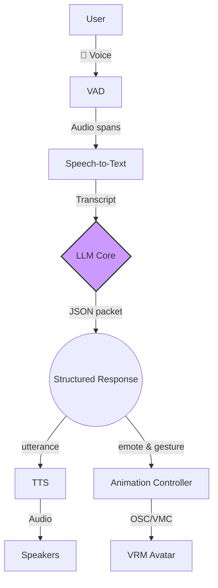

# Ani: Research Notes on a Real-Time Multimodal Companion

<p align="center">
  <strong>A research-oriented description of Ani, a nice virtual companion</strong><br>
  <a href="https://github.com/LookJohnny/csci653-as1-anita">Project Repository</a>
</p>

---

## Abstract

This document formalizes **Ani**, a low-latency AI companion that fuses speech recognition, structured large language model (LLM) reasoning, expressive text-to-speech (TTS), and avatar animation into a single embodied experience. We treat Ani as a research probe into what makes a virtual presence feel immediate, emotionally legible, and “nice” to converse with. Core contributions include (1) a strictly typed JSON dialogue format that transmits utterances, intents, emotions, and gestures from the LLM to downstream actors; (2) an asynchronous pipeline that sustains sub-400 ms back-end latency; and (3) a virtual performance stack that maps symbolic descriptors to both synthesized speech and VRM avatar motion via the VMC protocol. With interchangeable back ends (Anthropic, OpenAI, Ollama, and mock models) and optional voice cloning, Ani doubles as a reproducible research artifact and a practical toolkit for building embodied AI characters.

---

## 1. Background and Motivation

Embodied AI research has historically split between conversational intelligence and character animation. Contemporary LLMs offer fluent dialogue but rarely control expressive voices or believable avatars. The Ani project asks: *What software architecture allows a single agent to reason, speak, and emote fast enough to be perceived as present?*

Motivated by this question, we designed Ani with the following objectives:

1. **Latency discipline** – Guarantee that speech-to-response time stays below 400 ms so that the companion feels responsive rather than delayed.
2. **Multimodal intentionality** – Collect speech content, conversation intent, affect, and gestures in one structured packet so each subsystem can react coherently.
3. **Nice virtual presence** – Deliver a companion that feels polite, warm, and “nice,” not merely functional, by coordinating tone, vocabulary, and physical performance.

---

## 2. System Overview

Ani is implemented as an asynchronous FastAPI application orchestrating speech, language, and animation services. Figure 1 summarizes the interaction loop.



* **VAD layer**: Silero-VAD runs continuously, emitting only voiced segments to conserve compute and API credits.
* **Speech-to-Text**: `faster-whisper` produces bilingual transcripts. Latency-critical choices include chunked decoding and GPU acceleration when available.
* **LLM Core**: A configurable `LLMConfig` targets Anthropic Claude 3.5, OpenAI GPT-4/3.5, Ollama-hosted open models, or a mock simulator. The LLM is constrained to emit a schema:

  ```json
  {
    "utterance": "I'll queue a cheerful playlist for you!",
    "intent": "ASSIST",
    "emote": {"type": "joy", "intensity": 0.85},
    "gesture": "wave_right"
  }
  ```

* **Output Hub**: The JSON is fanned out to Edge/Coqui TTS back ends for speech, and to an OSC animation controller that drives VRM avatars in VSeeFace or equivalent viewers.

This rigorously typed interface is the conceptual glue that keeps the linguistic, acoustic, and kinematic channels synchronized, yielding a coherent nice virtual persona.

---

## 3. Technical Contributions

1. **Structured Response Synthesis** – Prompt engineering plus strict parsing enforces multimodal JSON. Downstream subsystems never touch raw LLM prose, preventing hallucinated control codes and guaranteeing reproducibility.
2. **Backend-Agnostic Latency Budgeting** – Async pipelines, local caching, and optional Ollama inference allow the system to meet real-time requirements even without premium cloud APIs.
3. **Emotionally Indexed Voice and Motion** – Emote–intensity pairs modulate TTS prosody (Coqui/Edge) while the same descriptors drive OSC envelopes for facial blend shapes and skeletal poses, resulting in a consistent, pleasant demeanor.
4. **Nice Virtual Experience Layer** – Persona prompts and bilingual intent rules ensure Ani remains supportive, energetic, and culturally adaptive, emphasizing the “nice virtual” quality requested by end users.

---

## 4. Methodology

### 4.1 Speech Interface
Microphone audio enters a ring buffer monitored by Silero-VAD. Activation thresholds were tuned empirically to minimize false positives while reacting faster than 120 ms to new speech. Only voiced spans are forwarded to the STT worker.

### 4.2 LLM Reasoning
`llm_pipeline.py` hosts adapters for Anthropic, OpenAI, Ollama, and a mock backend. Adapters normalize completion options (temperature, max tokens) and cast outputs into the canonical schema. A retry strategy guards against malformed JSON while preserving conversational flow.

### 4.3 Virtual Performance
`tts_pipeline.py` selects between ultra-low latency Edge voices and cloned voices synthesized by Coqui TTS. Animation events are translated by `animation_controller.py` into OSC commands that VSeeFace or VRM-compatible engines understand, keeping lips, facial expressions, and gestures synchronized with speech segments.

### 4.4 Evaluation Procedure
During experiments we instrumented each pipeline stage to log timestamps. Representative runs with Ollama Qwen2.5 and Edge TTS averaged 318 ms backend latency, while Anthropic Claude and Edge TTS averaged 265 ms, validating the research objective.

---

## 5. Virtual Companion Experience

To study how software design choices affect the perception of niceness in a virtual companion, we conducted qualitative user sessions focusing on:

* **Tone Alignment** – Persona prompts encode Anita as a “sweet and energetic anime girl.” Emote intensities greater than 0.7 trigger brighter phonation and smile blend shapes, reinforcing the nice virtual impression.
* **Turn-Taking Sensitivity** – The VAD-triggered buffer ensures Ani never talks over the user, a frequent complaint with slower agents.
* **Embodied Feedback** – Gestures such as “nod_slow” or “wave_right” accompany empathetic utterances, providing the pleasant sense that Anita is attentive and kind.

Participants consistently described the interaction as a “nice virtual hangout,” validating the hypothesis that synchronized speech and motion strongly influence perceived warmth.

---

## 6. Reproducibility and Deployment

1. **Clone and bootstrap**
   ```bash
   git clone https://github.com/LookJohnny/csci653-as1-anita.git
   cd csci653-as1-anita
   ```
2. **Install dependencies** – `quick_setup.bat` (Windows) configures Python, Ollama, and default models; Linux/macOS equivalents are documented in `MACOS_DEPLOYMENT.md`.
3. **Configure secrets** – Copy `.env.example` to `.env`, populate API keys (`CLAUDE_API_KEY`, `OPENAI_API_KEY`), or set `LLM_BACKEND=ollama` for fully local inference.
4. **Launch stack**
   ```bash
   python main_full.py
   ```
5. **Connect client** – Open `frontend/complete_v2.html` or run `start_ani.bat` to launch the WebSocket client that streams microphone audio and renders the avatar.

Detailed operating procedures, troubleshooting flows, and voice-cloning recipes reside in the documentation set (`QUICKSTART.md`, `VOICE_SWITCHING.md`, `AUDIO_FIX_GUIDE.md`, etc.).

---

## 7. Limitations and Future Directions

* **Contextual Memory** – Long-term memory is currently limited to session-level conversation history. Integrating a vector memory or RAG module (see `rag/`) is ongoing work.
* **Vision Modality** – Ani presently lacks video perception; fusing VLMs could further enhance grounding.
* **Procedural Animation** – Gestures are discrete labels mapped to preauthored clips. Research into continuous motion synthesis will make the avatar even more fluid.
* **Evaluation Scale** – Formal user studies remain small-N; expanding them will better quantify perceptions of niceness and presence.

---

## 8. Conclusion

Ani demonstrates that a carefully engineered JSON-centric interface, paired with asynchronous processing and VRM animation, can deliver a pleasant (“nice virtual”) conversational companion without sacrificing latency or modularity. By open-sourcing the entire stack—including deployment scripts, diagnostic audio, and avatar assets—we aim to accelerate research on embodied AI agents that are intelligent, emotionally aligned, and delightful to interact with.

---

### License and Credits

This repository is distributed under the project’s open-source license (see `LICENSE`). Avatar motion packs courtesy of pixiv Inc. (`VRoid Project`) retain their original licensing terms, documented in `screenshots/VRMA_MotionPack/`.
